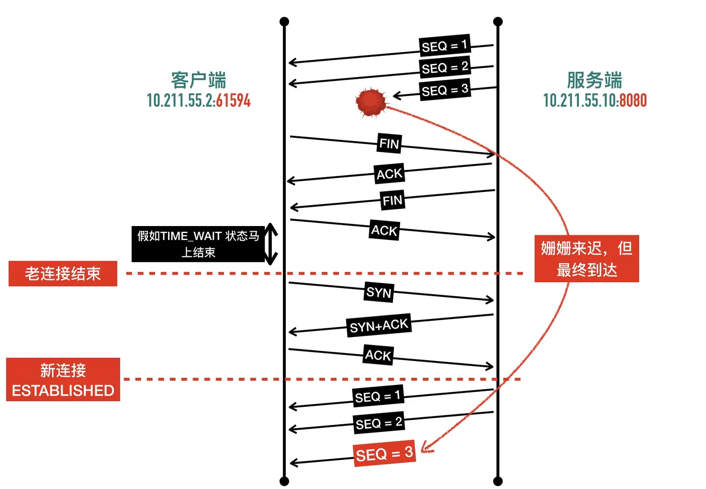

#### tcp报文


##### ethernet 网络接口层

###### 以太网  

###### Src: HuaweiTe_fa:f9:10 (58:f9:87:fa:f9:10) 源网卡

###### Dst: Apple_2f:dc:ab (38:f9:d3:2f:dc:ab) 目标网卡


##### internet protocol  网络协议

###### Total Length:117

###### Identification: 0x0000 (0)

###### Flags: 0x4000， Don't fragment       

###### Time to live: 64                                    存活时间

###### Protocol: TCP (6)                                          协议tcp

###### Header checksum: 0x90e2 [validation disabled]  验证tcp包的和

###### [Header checksum status: Unverified]  验证状态

###### Source: 10.0.0.10   源ip

###### Destination: 183.232.231.174 目标ip


##### transmission control protocol   传输协议

###### Source Port: 51037  源端口

###### Destination Port: 80 目标端口

###### [Stream index: 0]

###### [TCP Segment Len: 77] 

###### Sequence number:1

###### (relative sequence number)

###### [Next sequence number: 78

###### (relative sequence number)]

###### Acknowledgment number: 1(relative ack number)

###### 0101 .... = Header Length: 20 bytes (5)

###### Flags: 0x018(PSH，ACK)

###### Window size value: 4096

###### [Calculated window size:262144]

###### [Window size scaling factor: 64]

###### Checksum: 0x6545[unverified)

###### [Checksum Status:Unverified]

###### Urgent pointer:0

###### [SEQ/ACK analysis]

###### [Timestamps)

###### TCP payload (77 bytes)    负载


##### hypertext transfer protocol   超文本协议

###### GET / HTTP/1.1\r\n                      http

###### Host:www.baidu.com\r\n       百度

###### lear_Anant* rur1/7 54 a\r\n


##### 初始序列号

###### 初始序列号的计算函数 secure_tcp_sequence_number() 的逻辑是通过源地址、目标地址、源端口、目标端口和随机因子通过 MD5 进行进行计算。如果仅有这几个因子，对于四元组相同的请求，计算出的初始序列号总是相同，这必然有很大的安全风险，所以函数的最后将计算出的序列号通过 seq_scale 函数再次计算。seq_scale 函数加入了时间因子，对于四元组相同的连接，序列号也不会重复了。


##### ack和syn的区别

###### "ACK" 和 "SYN" 都是TCP协议中的关键字。

###### "SYN" 是TCP三次握手的第一个数据包，用于建立连接。当客户端发送一个SYN数据包给服务器时，服务器将返回一个SYN/ACK数据包作为确认，最后客户端会返回一个ACK数据包，以建立连接。

###### "ACK" 是TCP协议中的确认号，用于确认已经接收到的数据。当服务器收到客户端发送的数据时，会返回一个带有ACK确认号的数据包，以告知客户端已经成功接收到数据。

###### 因此，"SYN" 和 "ACK" 的主要区别在于它们的作用。"SYN" 用于建立连接，而"ACK" 用于确认已经接收到的数据。


#### TCP Flags

- ###### NS：表示“否定序列号”（No Sequencing），用于指定TCP分段中是否包含序列号。

- ###### CWR：表示“拥塞窗口调整”（Congestion Window Reduction），用于指定TCP分段中是否需要减小拥塞窗口。

- ###### ECE：表示“错误纠正编码”（Error Checking），用于指定TCP分段中是否需要进行错误检测和纠正。

- ###### URG：表示“紧急情况”（Urgent Pointer），用于指定TCP分段中紧急数据的位置。

- ###### ACK：表示“确认号”（Acknowledgment），用于指定TCP分段中确认号的位置。

- ###### PSH：表示“推送”（Push），用于指定TCP分段中是否需要将数据推送到接收方的缓存区中。

- ###### RST：表示“复位”（Reset），用于指定TCP连接的复位操作。

- ###### SYN：表示“同步”（Synchronize），用于指定TCP连接的同步操作。

- ###### FIN：表示“结束”（Finish），用于指定TCP连接的结束操作。


##### Windows size 窗口大小

###### 在TCP协议中，窗口大小是指接收方（即接收数据的一方）能够接收的未确认数据的数量。具体来说，窗口大小可以理解为接收方可以暂时存储未确认的数据的缓冲区大小。

window size value 4096   窗口大小

window size scaling factor：64  窗口大小缩放因子

实际的窗口大小为4096 * 64 = 262144字节


##### tcp为什么建立连接是3次，取消连接是4次

###### 1.TCP连接的三次握手和四次挥手是为了保证数据传输的可靠性和完整性。

###### 2.三次握手是为了确保客户端和服务器都能够正常接收和发送数据。在第一次握手时，客户端发送一个SYN数据包给服务器，服务器接收到后返回一个SYN/ACK数据包作为确认，最后客户端返回一个ACK数据包，以建立连接。

###### 3.四次挥手是为了确保数据传输完成后，客户端和服务器都能够正常关闭连接。在第一次挥手时，客户端发送一个FIN数据包给服务器，服务器接收到后返回一个ACK数据包作为确认，最后服务器发送一个FIN数据包给客户端，以告知客户端数据传输已经完成。客户端接收到后返回一个ACK数据包作为确认，最后客户端也发送一个ACK数据包给服务器，以关闭连接。

###### 4.因此，三次握手和四次挥手是为了保证数据传输的可靠性和完整性，以确保数据能够正确地传输和接收。

###### 5.三次握手的另一个重要作用是交换一些辅助信息，比如最大段大小（MSS）、窗口大小（Win）、窗口缩放因子（WS)、是否支持选择确认（SACK_PERM）


开启连接需要双方确定ack后方可开启连接

客户端：建立连接    syn

服务端：收到，确定连接    ack=syn+1，syn

客户端：收到   ack=syn+1，syn


##### 关闭连接需要输出方确认输出完毕   并且接收方接受完毕

###### 客户端.发送完了     fin

###### 服务端.ack确认      ack (在这一步服务端并不一定接受完并且处理完数据)


###### 服务端.接受完了    fin

###### 客户端.ack确认     ack


客户端打算关闭连接，此时会发送一个 TCP 首部 FIN 标志位被置为 1 的报文，也即 FIN 报文，之后客户端进入 FIN_WAIT_1 状态。

服务端收到该报文后，就向客户端发送 ACK 应答报文，接着服务端进入 CLOSED_WAIT 状态。

客户端收到服务端的 ACK 应答报文后，之后进入 FIN_WAIT_2 状态。

等待服务端处理完数据后，也向客户端发送 FIN 报文，之后服务端进入 LAST_ACK 状态。

客户端收到服务端的 FIN 报文后，回一个 ACK 应答报文，之后进入 TIME_WAIT 状态

服务器收到了 ACK 应答报文后，就进入了 CLOSE 状态，至此服务端已经完成连接的关闭。

客户端在经过 2MSL 一段时间后，自动进入 CLOSE 状态，至此客户端也完成连接的关闭。


作者：玄明Hanko
链接：https://www.zhihu.com/question/615892683/answer/3153783439
来源：知乎
著作权归作者所有。商业转载请联系作者获得授权，非商业转载请注明出处。


 TCP Option - Maximum segment size: 1460 bytes Kind: Maximum Segment Size (2) Length: 4 MSS Value: 1460 TCP Option - No-Operation (NOP) ▼ 

TCP Option - Window scale: 6 (multiply by 64) Kind: Window Scale (3) Length: 3 Shift count: 6 [Multiplier: 64]


#### 端口

最大 665536 

**熟知端口号（well-known port）**

###### 熟知端口号由专门的机构由 IANA 分配和控制，范围为 0~1023

**已登记的端口（registered port）**

###### 已登记的端口不受 IANA 控制，不过由 IANA 登记并提供它们的使用情况清单。它的范围为 1024～49151。

##### 临时端口

###### 的范围是 32768~60999。


##### systemtap

###### sudo apt install systemtap

###### ，他会在内核函数加 probe 探针，对 kernel space 函数调用进行统计汇总，甚至可以对其进行干预。但是对 user space 调试支持不是很好。


###### 握手可以变成四次,ack和syn分开发

###### 分手可以变成三次,中间的fin和ack一起发


##### TCP Fast Open 的优势

Fast Open

一个最显著的优点是可以利用握手去除一个往返 RTT，如下图所示


SO_REUSEPORT 端口复用


## 惊群问题（thundering herd）

在开始介绍惊群之前，我们下来看看一个现实世界中的惊群问题。假如你养了五条狗，一开始这五条狗都在睡觉，你过去扔了一块骨头，这五条狗都从睡梦中醒来，一起跑过来争抢这块骨头，最终只有第三条狗抢到了这块骨头，剩下的四条狗只好无奈的继续睡觉。


复用端口


## SO_LINGER

超时后是否重连

立刻重连和有超时时间重连

```c++
struct linger {
    int l_onoff;    /* linger active  是否启用 */  
    int l_linger;   /* how many seconds to linger for 是否立刻重连 */
};
```


``````java
//java代码
Socket socket = new Socket();
// 测试#1: 默认设置
socket.setSoLinger(false, 0);
``````


#### 全双工和半双工的区别

###### 全双工和半双工是网络通信中两种不同的通信方式。

###### 全双工通信是指在同一时间内，数据可以双向传输。这意味着通信的双方可以同时发送和接收数据，且不会发生数据冲突。在全双工通信中，通信双方需要共享一个传输媒介，如同一条电缆或光纤，以实现双向通信。

###### 半双工通信是指在同一时间内，数据只能单向传输。通信的双方不能同时发送和接收数据，必须轮流进行。在半双工通信中，通信双方需要使用两根不同的传输媒介，如一对电话线，一根用于发送数据，另一根用于接收数据。

###### 在实际应用中，全双工通信通常用于需要双向实时通信的应用，如视频通话、在线游戏等。而半双工通信则通常用于广播和对讲机等应用，如无线电广播、对讲机等。


## TIME_WAIT 存在的原因是什么

##### TIME_WAIT 等待时间是 2 个 MSL   2分钟    也就是端口两分钟无法复用,因为后面的应用会接受到不属于他的信息





## 为什么时间是两个 MSL(最长报文端生存时间)

##### 1 个 MSL 确保四次挥手中主动关闭方最后的 ACK 报文最终能达到对端

##### 1 个 MSL 确保对端没有收到 ACK 重传的 FIN 报文可以到达

##### 	2MS = 去向 ACK 消息最大存活时间（MSL) + 来向 FIN 消息的最大存活时间（MSL）


#### tcp_tw_reuse     tcp复用

###### `tcp_tw_reuse` 是 Linux 中的一个 TCP 套接字选项，允许在上一个连接关闭后立即重用 TIME_WAIT 套接字。

###### 要不然需要等待两个msl

###### 在 IPv4 中，MSL 的默认值为 2 分钟

###### 在 IPv6 中，MSL 的默认值为 120 分钟，也就是说，一个 IP 报文段在网络中可以存活的最长时间为 2 小时。


sack

快速重传


表明已确认了哪部分


重试时间

#### RTT  

是指一个数据包从发送方发送到接收方并返回所需的时间。它是通过测量从发送数据包开始到接收到对应的ACK确认帧之间的时间来计算的。

#### RTO

是一种重传机制，当发送的数据包没有收到相应的 ACK 确认帧时，TCP 协议会等待一定的时间（即 RTO 值），如果在这个时间内仍然没有收到 ACK，则会重新发送该数据包。

#### SRTT


经典算法引入了「平滑往返时间」（Smoothed round trip time，SRTT）的概念：经过平滑后的RTT的值，每测量一次 RTT 就对 SRTT 作一次更新计算

```ini
SRTT = ( α * SRTT ) + ((1- α) * RTT)
```

SRTT 是一个用于衡量网络传输质量的重要指标。它表示从发送端发出数据包到接收端接收到该数据包所花费的平均时间。
